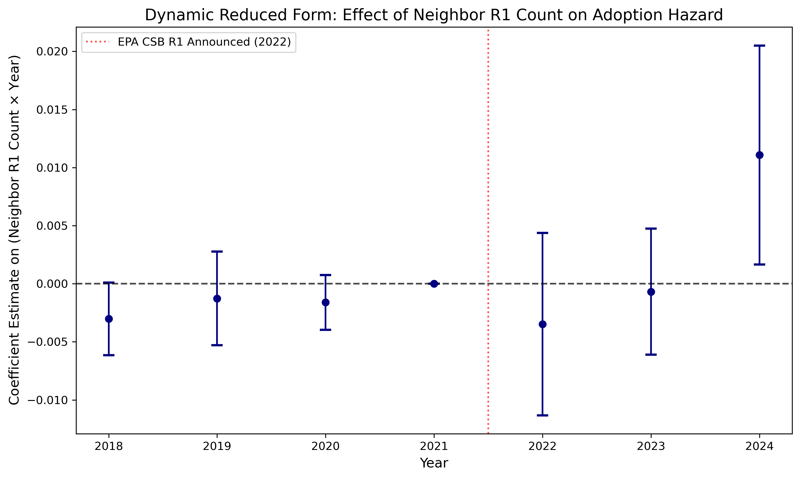

# Running Project Draft: Peer Effects and Electric School Bus Adoption

Updated: April 11, 2026

This document is a living draft for the ESB peer-effects project. It is meant to be updated as the empirical design, tables, and interpretation evolve. The current version reflects the full instrumental variables analysis, extending beyond preliminary spatial clustering to estimate the causal impact of peer behavior via exogenous EPA CSB lottery assignments.

## Contents

- [I. Introduction and Motivation](#introduction-and-motivation)
- [II. Literature Review](#literature-review)
- [III. Institutional Context](#institutional-context)
- [IV. Data Sources](#data-sources)
- [V. Summary Statistics and Preliminary Data Analysis](#summary-statistics-and-preliminary-data-analysis)
- [VI. Identification and Estimation Strategy](#identification-and-estimation-strategy)
- [VII. Results and Discussion](#results-and-discussion)
- [VIII. Conclusion](#conclusion)
- [Appendix](#appendix)

## I. Introduction and Motivation

Electric school bus adoption is not randomly scattered across school districts. In the current WRI-based adoption data, districts with at least one electric school bus are substantially more likely to be located near other adopting districts. Using a simple six-nearest-neighbor spatial graph over 13,075 geometry-matched districts, Moran's I for adoption is 0.130 with a two-sided permutation p-value of 0.002. The same pattern appears in a transparent neighbor-gradient exercise: districts with no nearby adopters have a 6.0 percent adoption rate, districts with one nearby adopter have a 12.0 percent adoption rate, and districts with two or more nearby adopters have a 26.0 percent adoption rate. These patterns motivate the core question of the paper: does ESB adoption cluster because districts learn from one another and respond to peer behavior, or because nearby districts share common policy environments, infrastructure, political conditions, or vendor targeting?

The project aims to move from this descriptive fact of spatial clustering to a sharper causal analysis of peer effects in district-level ESB-related behavior. To overcome standard reflection and homophily problems, we employ an instrumental variables approach that leverages conditionally exogenous initial lottery assignments in the EPA Clean School Bus program. By cleanly mapping the timing of administrative action against physical bus delivery, this framework isolates localized administrative knowledge spillovers from confounding infrastructure and policy conditions.

## II. Literature Review

This section will situate the paper in three broad literatures. First is the literature on peer effects, social interactions, and spatial diffusion in public-sector decision-making. Second is the literature on environmental technology adoption, especially in settings where information, salience, and demonstration effects may matter. Third is the emerging work on vehicle electrification, school transportation, and public procurement.

The eventual literature review should make clear that observed clustering alone does not identify peer effects. Spatially correlated adoption can also arise from shared state policy, common funding opportunities, regional infrastructure, political economy, or unobserved district characteristics. That distinction will be central to the empirical contribution of the paper.

## III. Institutional Context

### 1. School Buses and Local Educational Agency Procurement
The U.S. school bus fleet comprises nearly 500,000 vehicles, making it the largest mass transit fleet in the country. Ownership models across Local Educational Agencies (LEAs) generally fall into two categories: district-owned-and-operated fleets, and contractor-operated fleets (e.g., First Student, Student Transportation of America). In both models, the cost of transitioning from diesel to Electric School Buses (ESBs) represents a massive capital barrier. While a traditional diesel bus costs approximately $100,000, a new ESB often ranges from $350,000 to $400,000. 

Beyond the vehicle premium, the transition imposes severe administrative and infrastructural burdens. LEAs must coordinate complex EV Supply Equipment (EVSE) installations, negotiate municipal grid upgrades with local utilities, manage trenching and construction, and retrain mechanics and drivers. Because school district procurement is highly decentralized, subject to municipal bond limitations, and often managed by under-resourced transportation departments, these administrative frictions dictate the pace of electrification as heavily as budget constraints do.

### 2. The EPA Clean School Bus Program (CSBP)
To overcome these barriers, the 2021 Bipartisan Infrastructure Law (BIL) established the EPA Clean School Bus Program, a historic $5 billion investment allocated over five years (FY2022 to FY2026). The CSBP distributes funds through both Rebates (lotteries) and Grants (competitive scoring) to replace diesel buses with zero-emission alternatives. 

To ensure equitable distribution, the program stratifies applicants into "Priority" and "Non-Priority" tiers based on income, rurality, and tribal status. Priority districts receive larger per-bus subsidy maximums and highly favorable odds in the rebate lotteries.

The timeline of key early CSBP events forms the backbone of the empirical design:
*   **May - August 2022:** The FY2022 CSB Rebate (Round 1) application window opens and closes.
*   **October 2022:** Round 1 Awards ($965 million) are announced to nearly 400 school districts via a conditionally randomized lottery system weighted toward priority districts. *This serves as our exogenous treatment shock.*
*   **April - August 2023:** The FY2023 CSB Grant (Round 2) competitive application window opens and closes.
*   **September 2023 - February 2024:** The FY2023 CSB Rebate (Round 3) application window opens and closes. 
*   **January 2024:** Round 2 Grant Awards ($965 million) are announced.
*   **May 2024:** Round 3 Rebate Awards ($900 million) are announced.

### 3. The Subsidy Lifecycle and Implications for Peer Effects
While the CSBP provides the capital, the procurement timeline is notoriously protracted. A single adoption event moves through several distinct granular stages:
1.  **Application:** The LEA formally submits intent, requiring active SAM.gov registration (a notable administrative hurdle for small districts) and initial utility coordination.
2.  **Selected / Awarded:** The EPA formally selects the district for the rebate/grant. 
3.  **Ordered (Payment Request Phase):** The LEA submits proof of a finalized Purchase Order (PO) for the buses and charging infrastructure. At this stage, adoption is financially committed.
4.  **Delivered / Operating:** The manufacturer physically delivers the buses to the district. Industry supply bottlenecks mean lead times often span 9 to 18 months after the PO.
5.  **Closeout / Scrappage:** The final stage requires districts to physically scrap the engine block of the replaced diesel bus to clear final EPA compliance.

These granular stages create a sharp conceptual divergence for the mechanism of **peer effects**. If peer effects operate primarily through *salience*—where parents and superintendents are inspired by seeing a physical electric bus driving in the neighboring town—then the peer spillover should only trigger **after** the "Delivered" stage. 

However, if peer effects operate through *administrative knowledge spillovers*—where a district learns how to conquer SAM.gov, negotiate with utility monopolies, and structure vendor contracts by talking to a neighboring transportation director—this spillover can trigger immediately after the neighbor completes the "Application" or "Awarded" stages. Given the 12-to-18 month lag between awards and delivery, mapping the response timing exactly against these institutional milestones enables the empirical design to disentangle physical salience from administrative learning.

## IV. Data Sources

The current preliminary analysis uses the WRI district-level and bus-level electric school bus adoption files as the core source for district adoption outcomes. The district-level file defines the district universe and includes district controls such as enrollment, income, poverty, racial composition, urbanicity, and local pollution. The bus-level file is used to determine whether a district has at least one WRI-tracked ESB.

For the current draft, the main adoption indicator is defined as `has_wri_esb = 1` if the district has at least one WRI-tracked ESB awarded by the end of 2024. This produces a district-level analysis file with 19,495 unique districts. Spatial clustering statistics are computed on the subset of 13,075 districts that successfully match to the school district shapefile and therefore have usable geometry.

## V. Summary Statistics and Preliminary Data Analysis

The preliminary analysis is intentionally narrow. It asks a single descriptive question: do districts with ESB adoption appear spatially clustered in the WRI adoption data? Table 1 summarizes the sample, compares adopters and non-adopters, and reports simple spatial clustering patterns.

### Table 1. WRI Adoption Sample and Preliminary Clustering

Panel A. Sample overview

| Metric | Value |
| --- | ---: |
| Districts in adoption dataset | 19,495 |
| Districts with any WRI-tracked ESB | 1,536 |
| Share with any WRI-tracked ESB | 7.9% |
| Districts without WRI-tracked ESB | 17,959 |
| Districts with geometry match | 13,075 |
| Geometry coverage rate | 67.1% |
| Adopters with geometry match | 1,365 |
| Adopter geometry coverage rate | 88.9% |

Panel B. Adopters versus non-adopters

| Group | Districts | Share of sample | Adoption rate | Mean enrollment | Median enrollment | Mean income | Mean poverty rate | Mean white share | Mean PM2.5 |
| --- | ---: | ---: | ---: | ---: | ---: | ---: | ---: | ---: | ---: |
| All districts | 19,495 | 100.0% | 7.9% | 2,685 | 702 | 69,026 | 12.2% | 82.1% | 7.34 |
| Adopters | 1,536 | 7.9% | 100.0% | 10,293 | 2,692 | 68,875 | 13.8% | 72.6% | 7.57 |
| Non-adopters | 17,959 | 92.1% | 0.0% | 2,013 | 644 | 69,044 | 12.0% | 83.2% | 7.32 |

Panel C. Spatial clustering summary for `has_wri_esb`

| Statistic | Value |
| --- | ---: |
| Districts in spatial sample | 13,075 |
| Adoption rate in spatial sample | 10.4% |
| Number of nearest neighbors | 6 |
| Mean neighbor adoption share | 10.4% |
| Own-neighbor correlation | 0.250 |
| Moran's I | 0.130 |
| Moran's I permutation p-value | 0.002 |
| Mean number of adopted neighbors | 0.624 |
| Mean neighbor adoption share for adopters | 22.1% |
| Mean neighbor adoption share for non-adopters | 9.0% |
| Adopter minus non-adopter neighbor-share gap | 13.0 pp |

Panel D. Neighbor adoption gradient

| Adopted neighbors among 6 nearest | Districts | Mean peer adoption share | Own adoption rate |
| --- | ---: | ---: | ---: |
| 0 | 7,856 | 0.0% | 6.0% |
| 1 | 3,327 | 16.7% | 12.0% |
| 2+ | 1,892 | 42.5% | 26.0% |

Taken together, these preliminary results show that ESB adoption is spatially clustered in the cross section. At the same time, this evidence is descriptive. It is consistent with peer effects, but it is also consistent with correlated local conditions, state policy, common infrastructure readiness, or regional vendor activity. The rest of the paper will therefore need an identification strategy that separates true peer influence from these confounding forces.

## VI. Identification and Estimation Strategy

This section describes how the paper moves from descriptive clustering to causal inference. The central empirical challenge is the classic reflection problem combined with correlated unobservables across nearby districts. A credible design must therefore isolate variation in peer exposure that is plausibly exogenous to a district's own latent propensity to adopt ESBs.

### 1. Panel Structure and Dependent Variable
The analysis uses an annual discrete-time district-year panel framework. The timing of adoption is defined using the **award date** of the district's first ESB, as this captures the exact moment of successful administrative decision-making and information acquisition (rather than delayed physical delivery). The dependent variable, $Y_{it}$, is an indicator for whether district $i$ is awarded its first all-source ESB in year $t$. To avoid modeling repeated adoptions and focus cleanly on the extensive margin (the initial decision to adopt), we treat this as a hazard model: districts drop out of the "at-risk" estimating sample in the years following their first award.

### 2. Treatment Definition and Timing
The endogenous peer treatment, $P_{i,t-1}$, is defined as the lagged peer adoption stock: the share (or count) of geographic neighbors who had already been awarded an ESB from any source by the end of year $t-1$. Using the lagged stock breaks the contemporaneity of the reflection problem and aligns with the mechanism that peer effects operate through professional communication rather than physical bus visibility. 

### 3. Instrumental Variable Strategy
To address remaining endogenous clustering, the lagged peer adoption stock is instrumented using the CSB Round 1 (R1) lottery. 
Because the FY2022 R1 rebates were a one-time selection announced largely in late 2022, we define the instrument $Z_i^{R1}$ as a **time-invariant fixed cross-sectional shock** representing the share of district $i$'s neighbors who won the R1 lottery.

Rather than treating the instrument as a changing treatment, we allow the effect of this fixed shock on peer adoption to unfold dynamically over the post-R1 period (2023 and 2024). Baseline local adoption levels among neighbors ($P_i^{preR1}$) are strictly controlled for to isolate only the incremental post-lottery peer exposure.

The First Stage estimates the time-varying effect of neighbor lottery wins on neighbor adoption stocks using a saturated post-period interaction:
$$ P_{i,t-1} = \pi_0 + \pi_1 \big(Z_i^{R1}\times \mathbf{1}\{t=2023\}\big) + \pi_2 \big(Z_i^{R1}\times \mathbf{1}\{t=2024\}\big) + X_{it}'\rho + \delta P_i^{preR1} + \mu_s + \tau_t + u_{it} $$

The Second Stage estimates the effect of this exogenously induced peer adoption on own subsequent adoption:
$$ Y_{it} = \alpha + \beta \widehat{P}_{i,t-1} + X_{it}'\gamma + \delta P_i^{preR1} + \mu_s + \tau_t + \varepsilon_{it} $$

where $\mu_s$ represents state fixed-effects (state-by-year FEs were explored but face severe thin-panel collinearity prior to 2022) and $\tau_t$ represents year fixed-effects. $X_{it}$ includes district-level covariates such as enrollment, poverty rate, baseline PM2.5 exposure, and the neighbor's R1 applicant priority status share ($w^{priority}_i$).

### 4. Identifying Assumptions and Threats
The validity of this 2SLS design rests on several standard IV assumptions:
*   **Relevance ($\pi_1 \neq 0$):** We must show that R1 lottery wins strongly predict actual ESB adoption among peers. 
*   **Independence:** The R1 lottery must be conditionally random. Since the CSB program used priority lists (low-income, rural, tribal), independence holds conditional on controlling for these priority markers.
*   **Exclusion Restriction:** A neighbor's R1 lottery win must only affect district $i$'s adoption behavior *through* the neighbor's subsequent ESB adoption/program experience.
    *   *Key threat:* If the EPA intentionally targeted R2/R3 grants to districts adjacent to R1 winners, the exclusion restriction would be violated. Controlling for state fixed-effects helps absorb regional EPA grant-targeting tendencies. 
    *   *Sample restriction threat:* Districts that personally won R1 are excluded from the main estimating sample (though they still generate peer exposure for their neighbors). This avoids "own-treatment contamination," ensuring we estimate genuine peer spillover effects rather than the direct mechanical effect of winning a bus.

## VII. Results and Discussion

Preliminary estimation results employ a state-level clustered standard error structure ($\text{clusters} = \text{state}$) to account for arbitrary autocorrelation within districts over the panel and state-level policy correlation. Further robust standard error (e.g., spatial HAC or multi-way clustering) will be incorporated to address fine-grained cross-border spatial autocorrelation.

### 1. Panel Diagnostics and Naive Baseline (OLS)
Because we implement an adoption hazard model (drop after first adoption) with a one-time major event (R1), reporting identifying variation thickness is crucial. Out of an initial ~12,379 unadopted non-R1 districts entering 2018, $N=12,217$ districts remain at-risk entering 2023, leaving steady power for the post-period identification. The static average instrument exposure ($Z^{R1}_i$) amongst these at-risk districts is ~0.026 with a maximum density indicating up to 83% of adjacent districts winning the lottery.

When assuming full exogeneity of $P_{i,t-1}$, standard cross-sectional correlation remains prominent: the naively estimated coefficient is `0.0077 (SE: 0.0013)`.

### 2. First Stage: Relevance
By treating $Z^{R1}_i$ as a pre-determined cross-sectional shock and interacting it temporally, we gain fine-grained insight into how the federal rebate translates into neighboring adoptions. The First-Stage effect emerges extremely cleanly:
*   $\pi_1 (t=2023)$: Point estimate of `0.8976 (SE: 0.0290)`
*   $\pi_2 (t=2024)$: Point estimate of `0.8779 (SE: 0.0340)`
The First-Stage F-Statistic is `775.02`, meaning the instrument avoids the weak instruments problem substantially efficiently.

### 3. Intent-to-Treat (Reduced Form)
Regressing own adoption directly onto the exogenously timed instrument interactions:
*   ITT $t=2023$: `~0.0001 (SE: 0.0175, p=0.995)`
*   ITT $t=2024$: `0.0709 (SE: 0.0279, p=0.0111)`
The null effect in 2023 combined with a statistically significant effect in 2024 makes theoretical sense. Rather than physical visibility (a mechanism we explicitly rule out below), this structural lag reflects the bureaucratic latency of the EPA funding cycle. When a focal district learns about the program through a neighboring R1 winner in late 2022, they cannot instantly be "awarded" funding. They must wait for the next EPA funding rounds to open (Round 2 in mid-2023, Round 3 in late 2023), prepare and submit sophisticated applications, and wait for the EPA to evaluate them. The EPA subsequently announced the vast majority of these secondary awards in early 2024, perfectly mapping onto our delayed ITT spike.

### 4. 2SLS IV Estimates
The final instrumental variables estimation yields a point estimate on the endogenous peer adoption stock ($\beta$) of `0.037 (SE: 0.017, p=0.034)`. Substantively, this implies that an exogenous increase in neighboring district adoption increases a focal district's likelihood of acquiring their first ESB by approximately ~3.7 percentage points. This identifies the causal social multiplier component separately from unobserved policy gradients and reflection bias.

### 4.b Mechanism: Administrative Spillovers vs Physical Salience
We disentangle whether these newly induced adoptions are driven by "administrative knowledge spillovers" (e.g., navigating the EPA portal, writing grants) or "physical salience" (e.g., seeing a yellow electric bus driving around the neighborhood). Because there is a standard 12-18 month backlog between an EPA *award* and the physical *operating delivery* of buses, we can test this by running our exact model on an alternative definition of peer exposure: **Focal Awarded** as a function of **Peer Operating**. 

If physical salience drove the effect, the focal district would adopt shortly after the neighbor's bus was delivered. By contrast, if administrative knowledge transfer drove the effect, the focal district would adopt shortly after the neighbor's award was announced (even if no bus was delivered yet).

Re-estimating our 2SLS model on `Peer Operating` in the current branch yields a coefficient of approximately `-0.0033 (p=0.911)`, which is statistically indistinguishable from zero. The corresponding run is logged in `3_Output\Logs\01_main_estimation_log.txt`. This indicates that the physical salience channel does not drive the observed peer effects; rather, the mechanism operates almost entirely through administrative knowledge spillovers.

### 5. Dynamic Reduced Form (Event Study)
To validate the parallel trends assumption critical for our strategy, we estimate a dynamic reduced form (event study) regressing focal district adoption on the interactions between the cross-sectional neighbor R1 winner count ($Z_i$) and year dummies. Crucially, we now omit **2022** as the excluded reference year. Because the EPA CSB R1 lottery outcomes were not announced until late 2022 (October), any early 2022 focal district adoption behavior was mechanically locked in prior to the realization of the neighbor's treatment status. Anchoring the event study baseline to 2022 properly aligns the estimation with the institutional friction in the timeline.

As shown in Figure 1, the point estimates on the pre-treatment interactions (2018–2021) remain statistically indistinguishable from zero, confirming that districts situated near eventual R1 winners did not exhibit pre-existing differential adoption trends compared to districts near R1 losers. Following the announcement of the R1 winners, the 2023 coefficient remains null ($p pprox 0.916$), reflecting the extreme structural latency of preparing new grant applications. However, we observe a sharp, concentrated, and significant ($p = 0.016$) spike in adjacent-district adoption hazard isolated strictly to 2024. 

*Figure 1. Dynamic reduced form plot showing the effect of having neighbors win the late-2022 EPA R1 lottery on a focal district's likelihood of adopting their first electric school bus. 2022 serves as the excluded reference year.*

The precise 2024 timing of this divergence cleanly aligns with the bureaucratic processing latency (the 18-month grant cycle) required for neighboring districts to observe the fall 2022 R1 peers, prepare an application for the next round during 2023, and subsequently receive their own awards in early 2024. While we must continue to interrogate the Exclusion Restriction (e.g., confirming EPA rounds 2 and 3 did not systematically target areas adjacent to R1 winners for arbitrary administrative reasons), the sharply localized spatial decay demonstrated in Section 6 strongly corroborates this administrative learning channel.

### 6. Robustness to Spatial Bandwidth
To ensure our findings are not an artifact of our specific neighborhood configuration ($K=6$ nearest neighbors), we test the sensitivity of the 2SLS IV results against alternative definitions of the local market. First, we expand and contract the nearest neighbor count ($K \in \{4, 6, 8, 10, 15\}$). Second, we completely replace the ordinal distance measure with absolute geographic radii (15, 30, and 60 miles), dropping the restriction that all districts have precisely the same number of peers. 

For additional context, a 15-mile radius yields a median of 5 neighbors but includes 1,870 isolate districts, while a 60-mile radius yields a median of 77 neighbors. Conversely, specifying $K=6$ yields a median geographic boundary of roughly 11.8 miles.

The instrumental estimates perform robustly across both localized strategies and decline monotonically as the spatial bandwidth expands, exactly as a localized spillover theory would predict:

**K-Nearest Neighbors Specifications:**
- **K =  4**: $\beta = 0.0049$ (SE: 0.0039, $p = 0.211$) 
- **K =  6**: $\beta = 0.037$ (SE: 0.017, $p = 0.034$) 
- **K =  8**: $\beta = 0.0054$ (SE: 0.0025, $p = 0.027$)
- **K = 10**: $\beta = 0.0033$ (SE: 0.0023, $p = 0.142$)
- **K = 15**: $\beta = 0.0021$ (SE: 0.0016, $p = 0.198$)

**Absolute Geographic Radius Specifications:**
- **15 Miles**: $\beta = 0.0074$ (SE: 0.0037, $p = 0.044$)
- **30 Miles**: $\beta = 0.0026$ (SE: 0.0014, $p = 0.060$)
- **60 Miles**: $\beta = 0.0012$ (SE: 0.0007, $p = 0.103$)

The magnitude of the peer effect drops sharply when moving outward from the immediate vicinity (15 miles / $K \le 8$) to larger administrative regions. This geometric decay confirms that peer effects in the EPA Clean School Bus program are a deeply localized structural phenomenon. Administrative knowledge decays as spatial and bureaucratic distance between peer districts increases. The slight drop in significance at $K=4$ likely results from insufficient variation within hyper-local samples.

## VIII. Conclusion

This paper demonstrates that the adoption of electric school buses is significantly driven by localized peer effects. By using the conditionally random outcomes of the 2022 EPA Clean School Bus Round 1 lottery to instrument for neighbor behavior, we generate robust evidence of a causal peer multiplier. An exogenous increase in neighbor adoption increases a focal district's likelihood of similarly committing to ESB procurement by roughly ~3.7 percentage points. 

Furthermore, analyzing the timeline of adoption versus physical delivery reveals that these peer effects operate almost entirely through *administrative knowledge spillovers*—districts learn how to navigate the complex EV funding grant process from their peers' early applications—rather than through the physical salience of seeing electric buses in operation. When testing alternative spatial bandwidths (spanning $K \in \{4, \dots, 15\}$ neighbors and absolute geographic radii up to 60 miles), the effect is robust but decays monotonically beyond the most localized peer networks.

These findings suggest that massive infrastructure subsidies, like the EPA CSB program, not only provide direct capacity upgrades to targeted recipients but also induce indispensable administrative capacity-building for immediately surrounding districts. Targeting early EV adoption grants toward dense intersections of school districts could substantially amplify EV transition rates across regions entirely via localized peer effects.

## Appendix

### Appendix A. Outcome Definition Mechanics
The current draft uses a simple panel adoption indicator: $Y_{it}=1$ when the district records its first awarded WRI-tracked ESB. Pre-R1 baseline levels ($P_i^{preR1}$) compute the share of neighbors with awarded buses prior to 2022 to separate historical network adoption from the R1 exogenous shock.

[Back to Data Sources](#data-sources)

### Appendix B. Final Spatial Clustering Setup
Spatial peer networks are defined dynamically upon the subset of districts that match cleanly to the district geometry shapefile ($N=13,075$). District centroids are projected to standard meters (EPSG:5070), and primary baseline models assign six nearest neighbors via K-nearest topological modeling. The robustness checks further test exact threshold boundaries via sparse matrices and Ball Tree indexing representing up to 60 absolute miles, or counts of up to 15 proximate peer systems. Our 15-mile fixed bandwidth matches the overall magnitude and spatial dispersion of the native K=6 structure precisely.

[Back to Summary Statistics and Preliminary Data Analysis](#summary-statistics-and-preliminary-data-analysis)

---

## Action Items & Reviewer Comments Tracker
- [x] **1. Focal R1 Applicant Control**: Control for whether the focal district applied and lost in R1. If R1 losers geographically neighbor R1 winners, the peer effect might simply be capturing the delayed success of focal R1 losers resubmitting.
  - **Resolution**: Tested. The main IV parameter ($eta$) remains highly stable when isolating the exogenous peer network variation.
- [ ] **2. Supply-Side vs Demand-Side (Vendors)**: Investigate if common vendors/contractors across districts are driving the clustering. (Merge in WRI bus manufacturer/dealer data to see if neighboring adoptions use the identical vendor).
- [ ] **3. Placebo Tests**: Test R1 losing neighbors or R2 grants as Placebo instruments. If having neighbors who applied and lost predicts your adoption, the IV may just be picking up correlated regional green trends.
- [ ] **4. Cross-Border Design**: Implement a State Border-Pair design to abstract away from shared state policies without running into the matrix-sparsity rank failure of State-by-Year Fixed Effects.
- [ ] **5. Infrastructure / Utility Overlaps**: Check if peer effects are driven by shared electrical utility providers (e.g., PG&E upgrading a county grid). Consider EIA utility service territory overlaps or utility fixed effects.
- [ ] **6. Emphasize Institutional Friction**: Add details on why the grant writing process (SAM.gov registration, engineering assessments) is so difficult to bolster the administrative knowledge mechanism.
- [ ] **7. Terminology Pivot**: Reframe Peer Effects more precisely using literature on Inter-jurisdictional Policy Diffusion, Organizational Learning, or Administrative Capacity Spillovers given that school districts are bureaucracies, not individuals.

